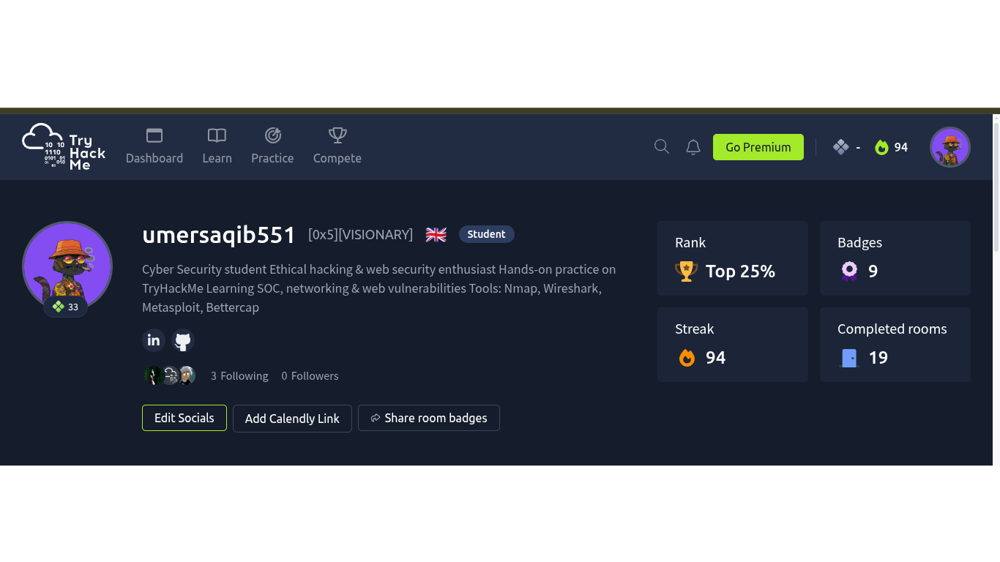

## TryHackMe Profile

I am Umer, an aspiring Cyber Security student passionate about ethical hacking, penetration testing, and network security. I actively use TryHackMe to strengthen my practical cybersecurity skills through hands-on labs, CTF-style challenges, and real-world attack simulations.

So far, I have successfully completed 19 TryHackMe rooms and maintained a 94-day learning streak, demonstrating consistency, discipline, and continuous skill development in cybersecurity.

My learning journey includes:

* Network Scanning & Enumeration
* Web Application Security Testing
* Linux & Windows Fundamentals
* Privilege Escalation
* Vulnerability Assessment
* Security Analysis & Threat Hunting

Hands-on experience with tools such as:

* Nmap
* Wireshark
* Burp Suite
* Gobuster
* OWASP ZAP
* Metasploit
* SpiderFoot

I continuously improve my skills by solving cybersecurity challenges, exploring security concepts, and documenting my learning journey through GitHub projects and walkthroughs.

🔗 TryHackMe Profile: https://tryhackme.com/p/umersaqib551

